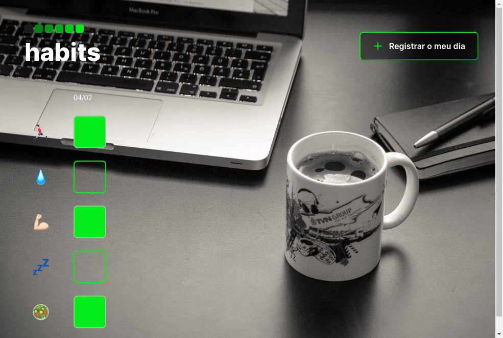

# NLW Setup
> Trilha Explorer

Projeto construído do evento Nlw Setupm, primeiro evento do ano da
Rocketseat.

[🔗Clique aqui para acessar](https://atilacsilva.github.io/nlw-setup) 

## 🚀 Tecnologias 

- HTML
- CSS
- javaScript
- Git e Github

### ✍️ O que aprendi!
Aprendi mais sobre responsovidade, novos comandos css e ainda mais JavaScript. Além de ter praticado bastante o básico do desenvolvimento Web!